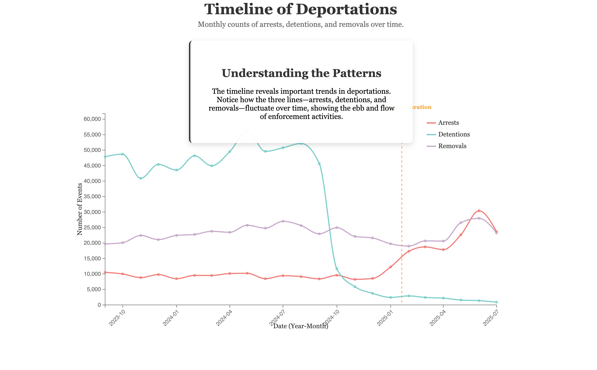
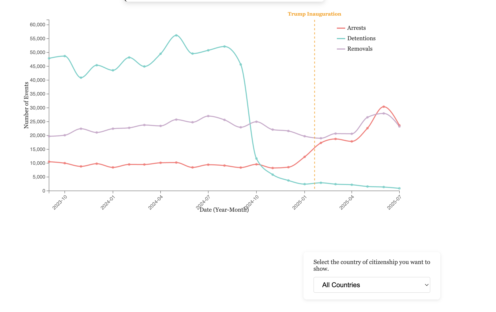
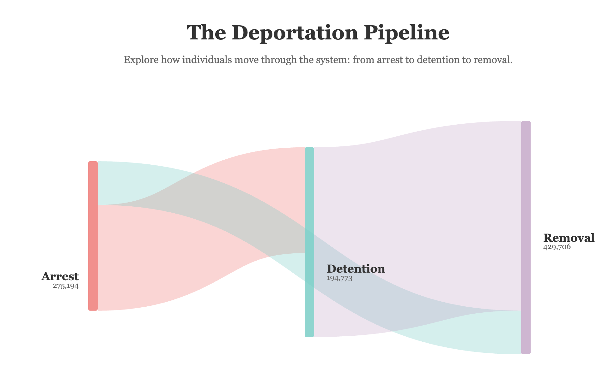
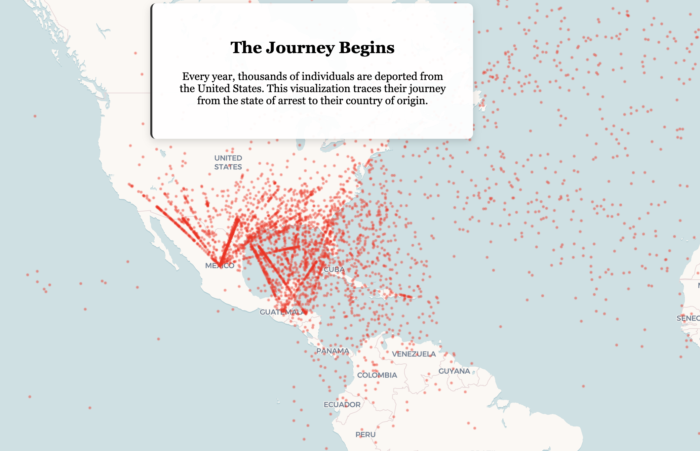

# In and Out: Migrations and deportations parents. 

Andres Felipe Camacho Baquero

## Goal

Right now to show only deportations, but in the final interactivity, I want to show some paragraphs and statistics about historic migrations and compositions, to call for attention on the deportations policy in a country made by inmmigrants. 

## Data Challenges

Data for the final linkages that show detentionnetworks is large so I am still thinking how to condense to show the routes of detentions that a person can go through inside the US before being deported. 

## Walk Through

The user starts with a timeline that renders slowling and that tell a narrative of the current government , then they can select the country to analyze , after that goes to a sankey  so it can see the flow, and then to the map .

## Questions

1. What storytelling structures (chapter markers, narrative annotations, audio cues, etc.) have you seen work well for turning aggregate migrant flows into a cohesive, comprehensible narrative without overwhelming the user?
2. Are there techniques for humanizing highly aggregated flow data—e.g., lightweight vignettes, name banks, or quote overlays—that would feel respectful yet still grounded in the administrative datasets I have?
3. Any guidance on how to give the Sankey a sense of movement (staggered easing, particle traces, progressive fills) so it feels alive while preserving readability/accessibility for audiences on slower machines?

Use of AI: I used to help me fix my code for interactions, debugging, and helping explore how to add movement to the timelines to be triggered with scrolling. 